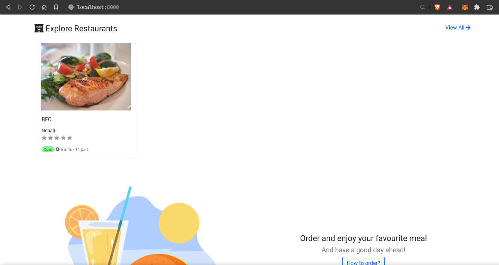
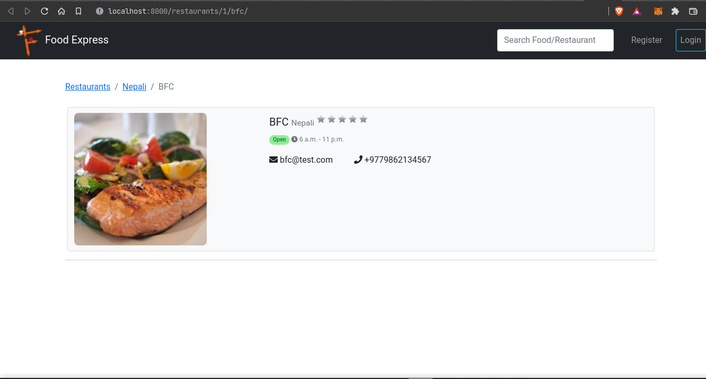

# Food Express

## Introduction




***Food Express*** is an online food delivery application providing restaurants and customers a platform to sell and buy cuisines respectively.

It is developed using Django web-framework and uses SQL-based database. It uses Python programming language for the rest of backend work.

## Getting Started

Set up virtual environment and install the dependencies using the commands:

```bash
python3 -m venv venv
source venv/bin/activate
pip install -r requirements.txt
```

Then run the Django development server using:

```
python manage.py runserver
```
To create a superuser (admin) account, run:

```
python manage.py createsuperuser
```

Navigate to `localhost:8000` in your browser.

## Developers
- [Shrawak Bhattarai](https://github.com/Shrawak)
- [Ramraj Chimouriya](https://github.com/RamrajCh)
- [Deependra Kumar Gupta](https://github.com/Deependra12)
- [Bishal Joshi](https://github.com/bishaljoshi08)
- [Shreyam Pokharel](https://github.com/pshreyam)
